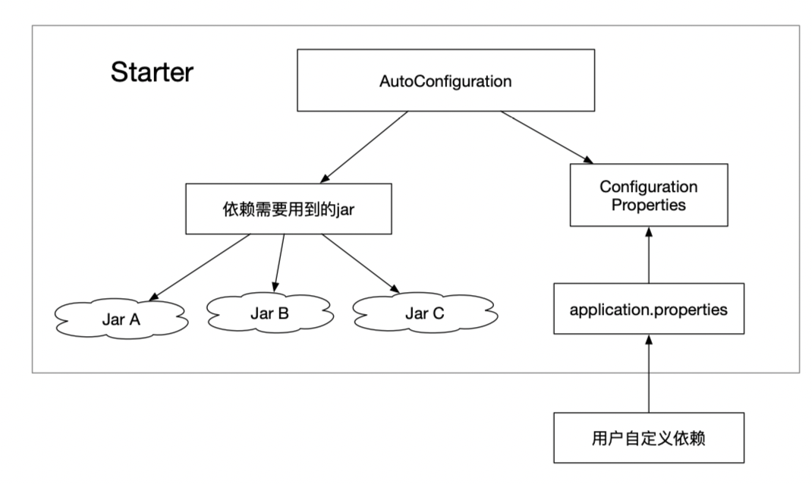

## Spring Boot Starter

### 什么是Spring Boot Starter

```
Starter POMs are a set of convenient dependency descriptors that you can include in your application. You get a one-stop-shop for all the Spring and related technology that you need, without having to hunt through sample code and copy paste loads of dependency descriptors. For example, if you want to get started using Spring and JPA for database access, just include the spring-boot-Starter-data-jpa dependency in your project, and you are good to go.
```

### 传统引入Spring Jpa的方法

- JPA（Java Persistence API，Java持久化API），定义了对象-关系映射（ORM）以及实体对象持久化的标准接口。

引入方法：
1. 在Maven中引入数据库依赖<dependency>
2. 引入JPA依赖
3. 配置xml属性信息或者写个config类
4. 调试运行

缺点是：
1. 步骤繁琐，出错概率高
2. 配置坑比较多

### 如何使用Spring Starter

为了解决上述问题，提出Starter的概念：



Starter的理念：Starter会把所有用到的依赖都给包含进来，避免了开发者自己去引入依赖所带来的麻烦。需要注意的是不同的Starter是为了解决不同的依赖，所以它们内部的实现可能会有很大的差异，例如JPA的Starter和Redis的Starter可能实现就不一样，这是因为Starter的本质在于synthesize，这是一层在逻辑层面的抽象，也许这种理念有点类似于Docker，因为它们都是在做一个“包装”的操作，如果你知道Docker是为了解决什么问题的，也许你可以用Docker和Starter做一个类比。

Starter的实现：虽然不同的Starter实现起来各有差异，但是他们基本上都会使用到两个相同的内容：ConfigurationProperties和AutoConfiguration。因为Spring Boot坚信“约定大于配置”这一理念，所以我们使用Configuration Properties来保存我们的配置，并且这些配置都可以有一个默认值，即在我们没有主动覆写原始配置的情况下，默认值就会生效，这在很多情况下是非常有用的。除此之外，Starter的ConfigurationProperties还使得所有的配置属性被聚集到一个文件中（一般在resources目录下的application.properties），这样我们就告别了Spring项目中XML地狱。

在“约定大于配置”的理念下，ConfigurationProperties还帮助用户减少了无谓的配置操作。并且因为 application.properties 文件的存在，即使需要自定义配置，所有的配置也只需要在一个文件中进行，使用起来非常方便。

### 自定义Spring Boot Starter

基本步骤是：
```text
1. 创建一个Starter项目
2. 创建一个ConfigurationProperties保存配置信息
3. 创建一个AutoConfiguration，引用定义的配置，在AutoConfiguration中实现所有starter应该完成的操作，并且把这个类加入spring.factories配置文件中进行声明
4. 打包项目，在其他项目中引用该依赖
```

1. 新建一个SpringBoot项目，pom.xml配置文件如下
```xml
<?xml version="1.0" encoding="UTF-8"?>
<project xmlns="http://maven.apache.org/POM/4.0.0" xmlns:xsi="http://www.w3.org/2001/XMLSchema-instance"
         xsi:schemaLocation="http://maven.apache.org/POM/4.0.0 https://maven.apache.org/xsd/maven-4.0.0.xsd">
    <modelVersion>4.0.0</modelVersion>

    <!-- 自定义starter都应该继承自该依赖 -->
    <!-- 如果自定义starter本身需要继承其它的依赖，可以参考 https://stackoverflow.com/a/21318359 解决 -->
    <parent>
        <groupId>org.springframework.boot</groupId>
        <artifactId>spring-boot-starters</artifactId>
        <version>1.5.2.RELEASE</version>
    </parent>


    <groupId>com.shgx</groupId>
    <artifactId>starter</artifactId>
    <version>0.0.1-SNAPSHOT</version>

    <properties>
        <java.version>1.8</java.version>
    </properties>

    <dependencies>
        <!-- 自定义starter依赖此jar包 -->
        <dependency>
            <groupId>org.springframework.boot</groupId>
            <artifactId>spring-boot-starter</artifactId>
        </dependency>
    </dependencies>

</project>
```
2. 创建配置文件properties, 保存配置信息
```java
@ConfigurationProperties(prefix = "test")
public class MyProperties {
    // 自动获取配置文件中前缀为test的属性，把值传入对象参数
    private String name = "hello";

    public String getName() {
        return name;
    }

    public void setName(String name) {
        this.name = name;
    }
}
```
3. 创建业务类TestService
```Java
public class TestService {
    private String name;

    public String getName() {
        return name;
    }

    public void setName(String name) {
        this.name = name;
    }

    public String test(){
        return "test service";
    }
}
```
4. 创建AutoConfiguration
```java
@Configuration
@EnableConfigurationProperties(MyProperties.class)
public class TestAutoConfiguration {

    @Resource
    private MyProperties properties;

    /**
     * 在Spring上下文中创建一个对象
     */
    @Bean
    @ConditionalOnMissingBean
    public TestService init(){
        TestService testService = new TestService();
        String name = properties.getName();
        testService.setName(name);
        return testService;
    }
}
```
在Spring上下文中创建一个MyProperties的配置bean, 并把properties的一个参数赋值给该bean

关于@ConditionalOnMissingBean的含义是：在该bean不存在的情况下，此方法才会执行，即仅在该注解规定的类不存在于Spring容器中时,使用该注解的config或者bean声明才会被实例化到容器中， 不会与本地bean冲突

最后，我们在 resources 文件夹下新建目录 META-INF，在目录中新建 spring.factories 文件，并且在 spring.factories 中配置AutoConfiguration：
```
org.springframework.boot.autoconfigure.EnableAutoConfiguration=\
com.shgx.starter.TestAutoConfiguration
```

5. 打包项目

执行
```
 mvn clean install -Dmaven.test.skip=true
```

6. 新建另一个项目[StarterTest](./StarterTest)，在项目中引入当前jar包

[引入方式参考](https://jingyan.baidu.com/article/e3c78d649e91df3c4d85f549.html)

```xml
    <dependencies>
        <dependency>
            <groupId>com.shgx</groupId>
            <artifactId>starter</artifactId>
            <version>0.0.1-SNAPSHOT</version>
        </dependency>
    </dependencies>
```

7. 创建业务类测试当前配置

Service
```Java
@Service
public class TestServiceInfo {
    @Resource
    private TestService testService;

    public String getName(){
        return testService.getName();
    }
}
```

Controller

```Java
@RestController
public class TestController {

    @Autowired
    private TestServiceInfo testServiceInfo;

    @GetMapping("/hello")
    public String testHello(){
        // http://localhost:8080/hello
        return testServiceInfo.getName();
    }
}
```

8. 直接访问
http://localhost:8080/hello

请求结果为：hello, 说明执行成功

修改配置文件application.properties
```
test.name="redefine the name"
```

重新访问http://localhost:8080/hello

请求结果为：redefine the name， 说明执行了本地配置，证明properties中的数据确实被覆盖了。
